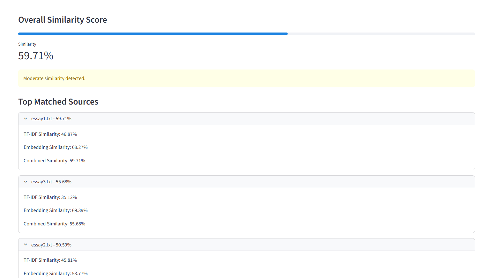
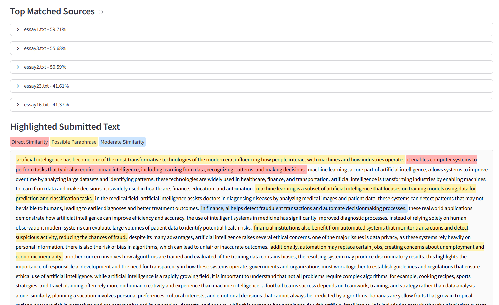
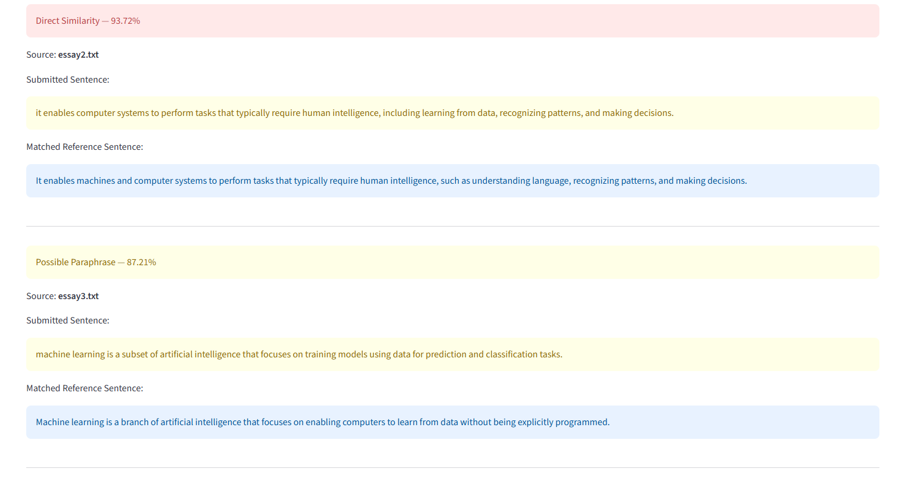

# AI Plagiarism Checker

An end-to-end plagiarism detection system that analyzes uploaded documents or text inputs, compares them against a reference dataset, and identifies similarity using NLP techniques such as TF-IDF and Sentence Transformers.

---

## Project Overview

This project allows users to upload assignments or paste text and compare it against a dataset of reference documents. It calculates similarity scores, detects paraphrased content, and highlights matched sentences using a combination of statistical and semantic NLP techniques.

---

## Features

* Upload `.txt`, `.pdf`, and `.docx` files
* Paste text directly for checking
* Compare against a reference dataset (20–50 documents)
* TF-IDF and Sentence Transformer-based similarity
* Cosine similarity scoring
* Sentence-level matching
* Paraphrase detection (semantic similarity)
* Highlighted text output
* FastAPI backend with REST API
* Streamlit frontend

---

## How It Works

```id="flow1"
User Input (File / Text)
        ↓
Text Parsing (.txt / .pdf / .docx)
        ↓
Text Cleaning + Sentence Splitting
        ↓
TF-IDF Vectorization
        ↓
Sentence Transformer Embeddings
        ↓
Cosine Similarity
        ↓
Match Classification
        ↓
Results + Highlighted Output
```

---

## Project Structure

```id="struct1"
AI-Plagiarism-Checker/
│
├── backend/
│   ├── app/
│   │   ├── main.py
│   │   ├── parser.py
│   │   ├── similarity.py
│   │   ├── database.py
│   │   └── schemas.py
│   │
│   ├── reference_docs/
│   └── requirements.txt
│
├── frontend/
│   ├── app.py
│   └── requirements.txt
│
├── README.md
├── .gitignore
└── venv/
```

---

## Setup Instructions

### 1. Clone the Repository

```bash id="setup1"
git clone https://github.com/YOUR_USERNAME/AI-Plagiarism-Checker.git
cd AI-Plagiarism-Checker
```

---

### 2. Create Virtual Environment

```bash id="setup2"
python -m venv venv
```

Activate:

Windows:

```bash id="setup3"
venv\Scripts\activate
```

Mac/Linux:

```bash id="setup4"
source venv/bin/activate
```

---

### 3. Install Dependencies

```bash id="setup5"
pip install -r backend/requirements.txt
pip install -r frontend/requirements.txt
```

---

## Running the Application

### Start Backend (FastAPI)

```bash id="run1"
cd backend
uvicorn app.main:app --reload
```

The backend runs locally at:

```id="run2"
http://127.0.0.1:<PORT>
```

You can specify a port manually:

```bash id="run3"
uvicorn app.main:app --reload --port 8000
```

API Docs:

```id="run4"
http://127.0.0.1:<PORT>/docs
```

---

### Start Frontend (Streamlit)

```bash id="run5"
cd frontend
streamlit run app.py
```

Frontend runs at:

```id="run6"
http://localhost:<PORT>
```

---

## Configuration

Update the backend URL in `frontend/app.py` if needed:

```python id="config1"
API_URL = "http://127.0.0.1:8000"
```

Recommended:

```python id="config2"
import os
API_URL = os.getenv("API_URL", "http://127.0.0.1:8000")
```

---

## API Endpoints

### GET /sources

Returns list of reference documents.

```json id="api1"
{
  "total_sources": 40,
  "sources": ["essay1.txt", "essay2.txt"]
}
```

---

### POST /check

Accepts:

* File upload OR
* Text input

Returns:

```json id="api2"
{
  "overall_similarity": 78.5,
  "top_matches": [...],
  "matched_sentences": [...],
  "highlighted_text": "<html>"
}
```

---

## Output Explanation

* **Overall Similarity**: Highest similarity score detected
* **Top Matches**: Most similar reference documents
* **Matched Sentences**: Sentence-level comparisons
* **Highlighted Text**: Visual marking of similar content

---

```md
## Screenshots

### 1. Main Interface

```md id="img1"

```

### 2. Similarity Results



### 3. Highlighted Text Output



### 4. Highlighted Percentages Output


```

---

## Technologies Used

* Python
* FastAPI
* Streamlit
* Scikit-learn (TF-IDF)
* Sentence Transformers
* NumPy
* pdfplumber
* python-docx

---

## Limitations

* Limited dataset size
* No internet-wide plagiarism detection
* Accuracy depends on dataset quality
* Basic sentence segmentation

---

## Future Improvements

* Use vector databases (FAISS, Chroma)
* Export plagiarism reports (PDF)
* Improve UI and highlighting
* Expand dataset size
* Optimize performance

---

## Author

Your Name
https://github.com/YOUR_USERNAME
